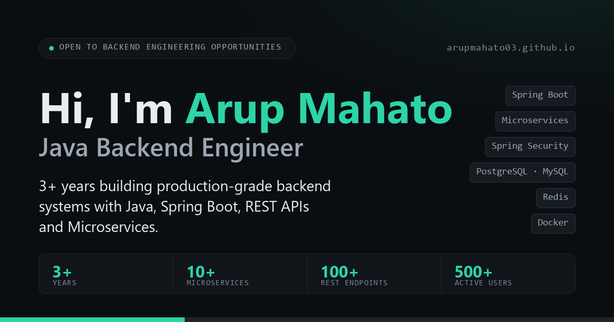
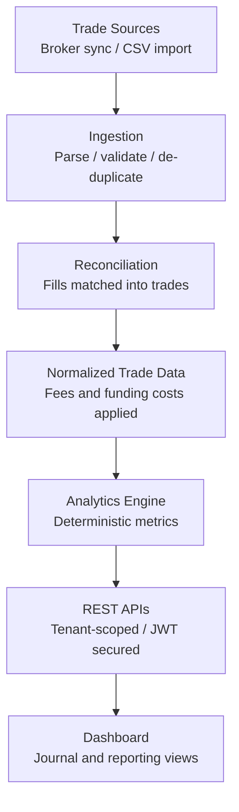

# Arup Mahato

**Java Backend Engineer** · Pune, India

[Portfolio](https://arupmahato03.github.io/) ·
[LinkedIn](https://www.linkedin.com/in/arup-mahato/) ·
[Résumé](Assets/Arup_Mahato_Java_Backend_Engineer_Resume.pdf) ·
[Email](mailto:arup71062@gmail.com)

I work on the server side of products — service boundaries, REST contracts, the data model underneath
them, and the failure cases that only show up in production. Most of what I build sits between an API and
a database, and the interesting part is keeping both honest.

**3+ years** backend engineering · **10+** Spring Boot microservices in production · **100+** secured REST
endpoints · **500+** users on a customer management system

---

## What I work on

| Area | In practice |
| --- | --- |
| **Backend systems** | Spring Boot microservices with clean REST contracts and layered architecture |
| **Security** | Spring Security, JWT authentication and role-based access control |
| **Payments** | Gateway integrations using idempotency keys and webhook reconciliation |
| **Database engineering** | Schema design, indexing, transactions and Hibernate/JPA tuning |
| **Performance** | N+1 query resolution, query optimization and Redis caching |
| **Integrations** | Third-party APIs, CRM and platform integration layers |

---

## Experience

### Backend Development Engineer · Togethring Media Labs

`Dec 2024 – Present` · Pune, India

- Designed and delivered 10+ Spring Boot microservices in production, defining service boundaries and REST
  contracts while decomposing monolithic functionality into independently deployable services
- Built and secured 100+ REST endpoints using JWT authentication and role-based authorization with Spring
  Security
- Integrated payment gateway flows handling 100+ monthly transactions, implementing idempotency keys and
  webhook reconciliation to prevent duplicate charges and payment mismatches
- Optimized Hibernate/JPA queries and MySQL schemas by resolving N+1 query issues, adding composite
  indexes, and introducing Redis caching for frequently accessed data
- Developed backend services for an analytics platform, aggregating event data and exposing reporting APIs
  consumed by internal dashboards
- Developed Wix plugin services and CRM integration layers for third-party data synchronization

**Stack** — Java · Spring Boot · Microservices · Spring Security · JWT · Hibernate/JPA · MySQL · Redis

### Java Backend Developer · Heliverse Technologies

`Jun 2023 – Sep 2024` · Gurugram, India

- Developed Spring Boot REST APIs for a Customer Management System serving 500+ active users
- Engineered a real-time property bidding system handling concurrent bids using database transactions and
  locking strategies to maintain data consistency under simultaneous access
- Implemented payment gateway integrations and role-based access control across core modules
- Collaborated with frontend, QA and product teams in Agile development

**Stack** — Java · Spring Boot · Spring Data JPA · REST APIs · MySQL · RBAC · Transactions

---

## Featured project — TradeDrift

**[TradeDrift](https://tradedrift.in/)** · Trading Journal & Backtesting Platform · *Backend Engineer,
personal project*

A trading journal and backtesting platform built as a real-world backend engineering project. The trading
domain is the surface; the engineering is ingestion, reconciliation and a data model that returns the same
numbers every time it is asked.

| | |
| --- | --- |
| **Data reconciliation** | Raw fills reconciled into normalized trades with fees and funding costs |
| **Deterministic analytics** | Win rate, expectancy, profit factor and drawdown computed consistently from trade data |
| **Multi-tenancy** | Tenant-scoped data isolation for users and their trading data |
| **Authentication & billing** | JWT authentication and subscription billing across pricing tiers |

The analytics engine's output is modelled for downstream AI analysis. That path is planned, not shipped.

---

## Tech stack

| | |
| --- | --- |
| **Backend** | Java · Spring Boot · Spring MVC · Spring Data JPA · Hibernate |
| **Architecture** | Microservices · REST API design · Layered architecture · SOLID principles |
| **Databases** | PostgreSQL · MySQL · MongoDB |
| **Performance** | Redis · Query optimization · Indexing · Transaction management |
| **Security** | Spring Security · JWT · OAuth 2.0 · RBAC |
| **Testing** | JUnit 5 · Mockito |
| **Tools** | Git · Maven · Docker · Postman · Swagger/OpenAPI · Linux |

### Currently deepening

> Study and practice areas — not production experience.

Apache Kafka · Distributed Systems · System Design · Cloud · CI/CD · Scalable backend architecture

---

## Connect

I'm open to conversations around Java backend engineering, backend architecture and production systems.

- **Email** — [arup71062@gmail.com](mailto:arup71062@gmail.com)
- **LinkedIn** — [arup-mahato](https://www.linkedin.com/in/arup-mahato/)
- **Portfolio** — [arupmahato03.github.io](https://arupmahato03.github.io/)
- **Résumé** — [PDF](Assets/Arup_Mahato_Java_Backend_Engineer_Resume.pdf)

